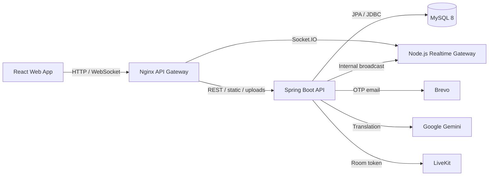

# WeConnect

WeConnect là nền tảng cộng đồng giúp người Việt Nam và người Nhật Bản kết nối,
giao lưu ngôn ngữ, xây dựng quan hệ bạn bè và tham gia các hoạt động văn hóa.
Hệ thống cung cấp hồ sơ cá nhân, kết bạn, nhắn tin và dịch thuật realtime, gọi
video, quản lý sự kiện và các trò chơi học tiếng Nhật.

Backend nghiệp vụ hiện được triển khai bằng Spring Boot. Node.js chỉ đảm nhiệm
vai trò realtime gateway bằng Socket.IO; hệ thống không còn sử dụng FastAPI hay
Pusher.

## Chức năng chính

### Xác thực và tài khoản

- Đăng ký tài khoản bằng email và xác minh OTP.
- Đăng nhập, đăng xuất và tự động làm mới phiên đăng nhập.
- Quên mật khẩu, xác minh OTP và đặt lại mật khẩu.
- Access token được lưu trong HttpOnly cookie.
- Refresh token và password-reset token là token opaque; database chỉ lưu hash.
- Giới hạn số lần gửi và nhập sai OTP để giảm spam và brute-force.

### Hồ sơ và khám phá người dùng

- Xem và cập nhật hồ sơ cá nhân.
- Upload avatar và ảnh bìa.
- Quản lý sở thích, trình độ tiếng Nhật, nghề nghiệp và thông tin giới thiệu.
- Chọn ngôn ngữ ưu tiên.
- Tìm kiếm người dùng và nhận gợi ý kết nối.
- Xem hồ sơ công khai của người dùng khác.

### Bạn bè

- Gửi, chấp nhận, từ chối và hủy lời mời kết bạn.
- Xem lời mời đã nhận hoặc đã gửi.
- Tìm kiếm và phân trang danh sách bạn bè.
- Hủy kết bạn.

### Chat và dịch thuật realtime

- Hội thoại riêng giữa hai người bạn.
- Gửi tin nhắn văn bản, hình ảnh và file đính kèm.
- Danh sách hội thoại, lịch sử tin nhắn và phân trang theo cursor.
- Trạng thái đang nhập, đã đọc và số tin chưa đọc được cập nhật realtime.
- Dịch tin nhắn Việt–Nhật theo yêu cầu bằng Google Gemini.
- Cache bản dịch theo tin nhắn và ngôn ngữ đích.
- Spring ghi dữ liệu và phát domain event sau khi transaction commit; Node.js
  Socket.IO chịu trách nhiệm chuyển event đến trình duyệt.

### Gọi video

- Tạo và nhận cuộc gọi video giữa hai người dùng.
- Chấp nhận, từ chối, hủy, timeout và kết thúc cuộc gọi.
- Quản lý state cuộc gọi và kiểm tra quyền tham gia tại Spring Boot.
- Spring cấp LiveKit room token; trình duyệt không tự gửi room name tùy ý.
- Thông báo trạng thái cuộc gọi được gửi qua Socket.IO.

### Sự kiện

- Xem, tìm kiếm và lọc danh sách sự kiện.
- Xem chi tiết, đăng ký hoặc hủy đăng ký tham gia.
- Gửi và xem đánh giá sự kiện.
- Tài khoản `ORGANIZER` có thể tạo, cập nhật, xóa và upload ảnh sự kiện.
- Organizer có thể xem tổng quan, thống kê và danh sách người tham gia.

### Trò chơi cộng đồng

- Danh sách game và phòng đang mở.
- Tạo phòng, tham gia bằng mã hoặc ghép phòng ngẫu nhiên.
- Trạng thái sẵn sàng, bắt đầu, tạm dừng, tiếp tục và kết thúc phòng.
- Chat trong phòng và bảng xếp hạng realtime.
- Quiz văn hóa Nhật Bản và luyện đọc Kanji theo vòng tính điểm.
- Shiritori (nối từ tiếng Nhật) với thiết lập kana, mora, thời gian lượt và ngân
  hàng từ được đóng gói trong Spring resources.

## Kiến trúc hệ thống



### Phân chia trách nhiệm

| Thành phần | Trách nhiệm |
| --- | --- |
| React frontend | Giao diện, routing, cache dữ liệu client và kết nối realtime |
| Nginx | Public gateway, reverse proxy REST, resource và Socket.IO |
| Spring Boot | Toàn bộ business API, xác thực, phân quyền, transaction và lưu trữ |
| Node.js `ws-server` | Xác thực kết nối Socket.IO và phát event tới private user room |
| MySQL | Dữ liệu người dùng, phiên, bạn bè, chat, call, event và game |
| LiveKit | Media transport cho cuộc gọi video |
| Brevo | Gửi OTP qua email |
| Google Gemini | Dịch tin nhắn Việt–Nhật |

## Tech stack

### Frontend

- React 18, TypeScript 5.9 và Vite 8.
- React Router, TanStack Query và React Hook Form.
- Tailwind CSS, Radix UI, Framer Motion và Lucide Icons.
- i18next cho đa ngôn ngữ.
- Socket.IO Client cho realtime.
- LiveKit React Components cho giao diện gọi video.
- Vitest cho unit test.

### Backend

- Java 21 và Spring Boot 4.1.
- Spring Web MVC, Spring Security và Jakarta Validation.
- Spring Data JPA/Hibernate, MySQL Connector và Flyway.
- JJWT cho access token; BCrypt cho mật khẩu.
- Google Gen AI SDK cho dịch thuật.
- LiveKit Server SDK cho room token.
- JUnit, Spring Boot Test và H2 cho kiểm thử.

### Realtime và hạ tầng

- Node.js 18, Express, Socket.IO và `jsonwebtoken`.
- Nginx API Gateway.
- MySQL 8.
- Docker và Docker Compose.
- Named volumes cho MySQL và file upload.

## Cấu trúc repository

```text
WeConnectApp/
├── frontend/          React + TypeScript web application
├── spring-backend/    Spring Boot business backend
├── ws-server/         Node.js Socket.IO realtime gateway
├── nginx/             Reverse proxy và API gateway
├── database/          Schema, seed và script database hiện tại
├── docs/              Tài liệu kỹ thuật
├── design/            API, C4, class, ERD và use-case diagrams
└── docker-compose.yml Local backend infrastructure
```

## Yêu cầu môi trường

Để chạy theo cách khuyến nghị:

- Docker Desktop và Docker Compose.
- Node.js 18 trở lên.
- pnpm 10.

Nếu chạy Spring trực tiếp ngoài Docker, cần thêm Java 21 và Maven 3.9 hoặc Maven
Wrapper đi kèm dự án.

## Cấu hình môi trường

Tạo file `.env` tại thư mục gốc. Không commit giá trị secret thật lên Git.

```dotenv
# Bắt buộc: dùng chung giữa Spring và Socket.IO để xác minh access JWT
SECRET_KEY=replace-with-a-long-random-secret-at-least-32-bytes

# Nên dùng một secret riêng cho API broadcast nội bộ
WS_INTERNAL_SECRET=replace-with-another-long-random-secret
WS_SERVER_INTERNAL_URL=http://ws-server:3000

# Origin được phép gọi API và mở Socket.IO
CORS_ALLOWED_ORIGINS=http://localhost:8081,http://localhost:8080

# Email OTP
BREVO_API_KEY=
BREVO_FROM_EMAIL=
OTP_EXPIRE_MINUTES=5

# Dịch thuật
GOOGLE_API_KEY=
GEMINI_MODEL=

# Video call
LIVEKIT_URL=
LIVEKIT_API_KEY=
LIVEKIT_API_SECRET=

# Tùy chọn
SPRING_PROFILES_ACTIVE=dev
UPLOAD_DIR=/app/uploads
WS_CONNECT_TIMEOUT_MS=3000
WS_READ_TIMEOUT_MS=5000
```

Trong môi trường production, cấu hình thêm:

```dotenv
SPRING_PROFILES_ACTIVE=prod
APP_DOMAIN=
CORS_ALLOWED_ORIGINS=https://your-frontend.example.com
```

Frontend mặc định gọi cùng origin. Khi frontend và gateway khác origin, tạo
`frontend/.env.local`:

```dotenv
VITE_API_URL=http://localhost:8080
VITE_WS_URL=http://localhost:8080
```

## Chạy dự án

### 1. Khởi động backend infrastructure

Tại thư mục gốc:

```bash
docker compose up --build -d
```

Các địa chỉ local:

| Dịch vụ | Địa chỉ | Ghi chú |
| --- | --- | --- |
| API Gateway | `http://localhost:8080` | URL backend công khai nên dùng |
| Health check | `http://localhost:8080/health` | Kiểm tra Spring Boot |
| Spring Boot | `http://localhost:8002` | Cổng debug trực tiếp |
| Socket.IO | `http://localhost:3000` | Cổng debug trực tiếp |
| MySQL | `localhost:3308` | Database `weconnect` |

Xem trạng thái và log:

```bash
docker compose ps
docker compose logs -f spring_backend ws_server api_gateway
```

### 2. Khởi động frontend

```bash
cd frontend
pnpm install
pnpm dev
```

Mở `http://localhost:8081`.

Vite dev server tự proxy `/api/v1`, `/uploads`, `/static` và `/socket.io` sang
Nginx tại `http://localhost:8080`.

### 3. Dừng hệ thống

```bash
docker compose down
```

Không thêm `-v` nếu muốn giữ dữ liệu MySQL và file upload hiện tại.

## Tài khoản mẫu

Các tài khoản seed sử dụng mật khẩu `Password@123`.

| Email | Vai trò | Trạng thái |
| --- | --- | --- |
| `nguyen.tuan@gmail.com` | USER | Đã xác thực |
| `tran.linh@gmail.com` | USER | Đã xác thực |
| `pham.anh@gmail.com` | USER | Đã xác thực |
| `le.mai@gmail.com` | USER | Chưa xác thực, dùng kiểm tra OTP |
| `hoang.duc@gmail.com` | USER | Đã xác thực |
| `organizer.han@weconnect.vn` | ORGANIZER | Đã xác thực |
| `organizer.minh@weconnect.vn` | ORGANIZER | Đã xác thực |

## Kiểm thử và build

### Frontend

```bash
cd frontend
pnpm typecheck
pnpm test
pnpm build
```

### Spring Boot

Linux/macOS:

```bash
cd spring-backend
./mvnw test
./mvnw clean package
```

Windows:

```powershell
cd spring-backend
.\mvnw.cmd test
.\mvnw.cmd clean package
```

### Realtime server

```bash
cd ws-server
npm install
npm start
```

## Bảo mật

- Không commit `.env`, API key hoặc token thật.
- Frontend nên truy cập backend qua Nginx thay vì gọi trực tiếp từng service.
- Production phải dùng HTTPS để cookie `Secure` và `SameSite=None` hoạt động.
- `SECRET_KEY` phải đủ dài và giống nhau ở Spring với realtime gateway.
- Nên cấu hình `WS_INTERNAL_SECRET` khác `SECRET_KEY` trong production.
- Chỉ `ORGANIZER` được tạo và quản lý sự kiện.
- Upload được kiểm tra loại file, kích thước và tên file an toàn tại Spring.

## Trạng thái migration

- FastAPI đã được loại khỏi runtime và source tree.
- Pusher đã được loại khỏi frontend dependencies.
- Spring Boot sở hữu toàn bộ business API và resource.
- Node.js Socket.IO được chủ động giữ lại cho realtime.

## License

Xem [LICENSE](LICENSE).
